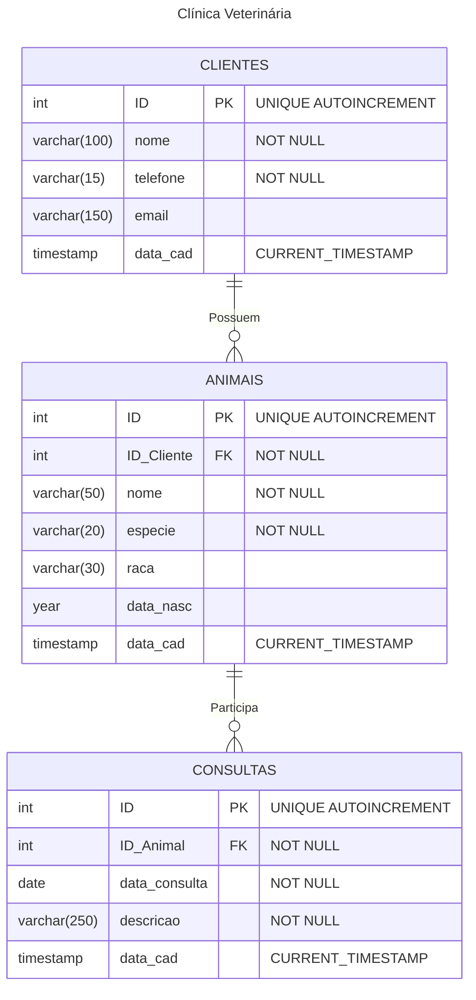

```mermaid
---
title: Clínica Veterinária
---
erDiagram

    CLIENTES {
        int ID PK "UNIQUE AUTOINCREMENT"
        varchar(100) nome "NOT NULL"
        varchar(15) telefone "NOT NULL"
        varchar(150) email
        timestamp data_cad "CURRENT_TIMESTAMP"
    }

    ANIMAIS {
        int ID PK "UNIQUE AUTOINCREMENT"
        int ID_Cliente FK "NOT NULL"
        varchar(50) nome "NOT NULL"
        varchar(20) especie "NOT NULL"
        varchar(30) raca
        year data_nasc
        timestamp data_cad "CURRENT_TIMESTAMP"
    }

    CONSULTAS {
        int ID PK "UNIQUE AUTOINCREMENT"
        int ID_Animal FK "NOT NULL"
        date data_consulta "NOT NULL"
        varchar(250) descricao "NOT NULL"
        timestamp data_cad "CURRENT_TIMESTAMP"
    }

CLIENTES ||--o{ ANIMAIS : "Possuem"
ANIMAIS ||--o{ CONSULTAS : "Participa"
```